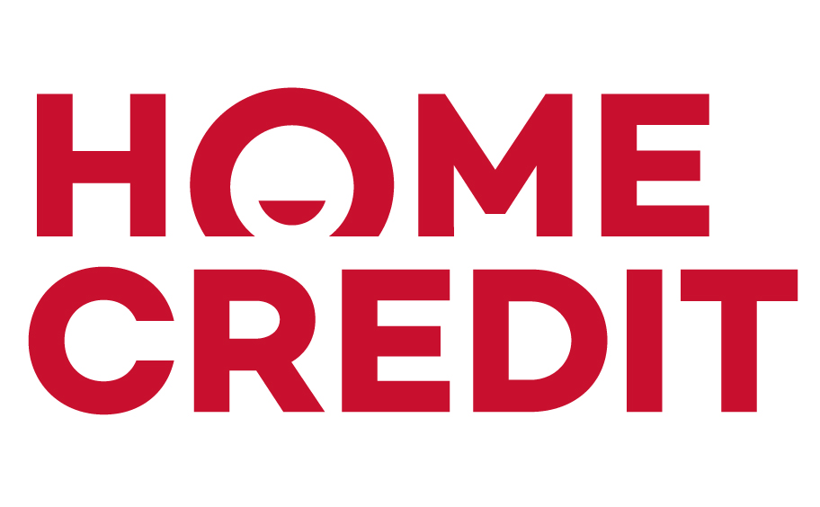
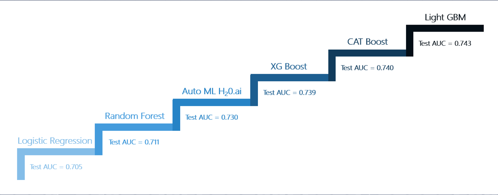

# Predicting the loan repayment capability of people without any credit history

# Introduction
This porject was done for the Predictive Modeling coursework under the guidance of [Prof. Carlos Carvalho](https://www.mccombs.utexas.edu/Directory/Profiles/Carvalho-Carlos) 
Home Credit is a non-banking financial institution that strives to broaden the financial inclusion by offering positive and safe borrowing experience to people with little or no credit history. Providing loan to these people opens them up to the risks of defaulting. To tackle this and to ensure that clients capable of repayment are not rejected, they put up a challenge in Kaggle

# Data Overview
They provided transactional information, annual income, education level, family status, housing type, credit card payment details etc for each client along with information about previous credits they borrowed from other financial institutions 
Datasource: https://www.kaggle.com/c/home-credit-default-risk/data

# Approach
•	Checked for null values and either dropped those rows/columns or imputed them using the Iterative imputer 
•	Used SMOTE to handle the class imbalance 
•	Created new features by creating interaction terms and grouping certain numerical variables 
•	Thorough EDA to understand the customer base and spot trends that signal cases of default

# Key takeaways
•	Low external score is a strong indicator for default 
•	Customer Age and duration of employment influence the default rate 
•	Boosting works the best, but Logistic Regression also gave us really good results. So, it is better to choose Logistic Regression for the benefit of time and interpretability
